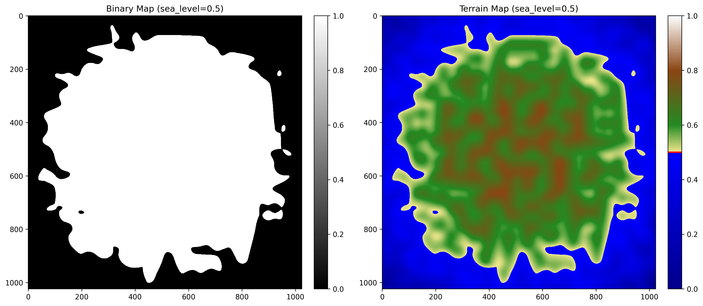
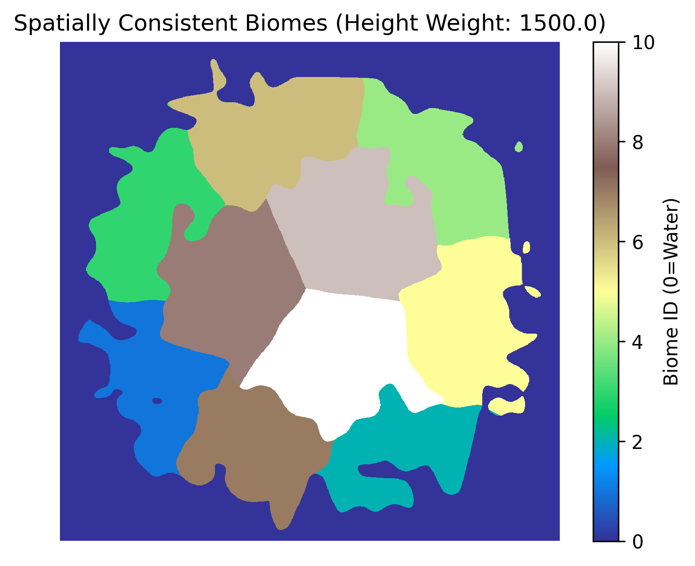

# Fortnite-PCG

## Abstract

This project focuses on the development of a PCG system designed to automatically create nature-like and balanced Battle Royale mode maps. 
The system focuses on generating a 2D topographical blueprint that serves as the foundation for environmental layout, biome partitioning, and structural placement.

## Background

Procedural Content Generation (PCG) enables the automatic creation of large game environments, reducing manual design effort while increasing replayability. In Battle Royale games, terrain layout strongly influences gameplay balance and player strategy, making natural-looking landscapes especially important. This project applies PCG techniques to generate Fortnite-inspired island maps that imitate real-world terrain features such as varied elevation and coastlines.

## Project goals

We wanted to automatically create maps in 2D (or 3D - ambitious goal), depending on given seed.

## Methodology

The map generation process is divided into several distinct stages, combining procedural noise generation with machine learning for natural-looking results:

### Already completed:

* **Island morphology generation** - a heightmap is generated to define the main island shape and elevation features. This stage establishes the foundational topography using a combination of Perlin noise and a custom distance gradient. To ensure the land forms a centralized island, a distance mask is calculated using a power metric ($|x|^p + |y|^p$). This gradient is then subtracted from the raw Perlin noise, forcing elevation values to decrease as they approach the map boundaries. The final heightmap is normalized, saved as island_noise_map.npy, and exported as step1_island_visualization.png for quality verification.

* **Biome partitioning** - To achieve natural and smooth transitions, the island is divided into distinct biomes using K-means clustering that analyzes pixel coordinates alongside heightmap data. By adjusting the height_weight parameter, the algorithm balances whether biomes follow elevation contours like altitudinal zones or form irregular geographic patches across the landscape. Finally, the clusters are deterministically ranked by mean elevation to ensure that biome IDs consistently represent the terrain's progression from sea level to mountain peaks.

### To be done:

* **Terrain decoration** (In Progress) - biome-specific environmental elements (e.g., canyons in deserts or higher mountains) are procedurally added while preventing overlaps through spatial constraints. This stage utilizes rule-based placement to ensure that every feature remains consistent with its specific climate, local terrain slope, and the overall visual coherence of the map.

* **Cities placement and path generation** - cities are procedurally placed and connected with efficient traversal paths using search-based and heuristic methods (Simulated Annealing).

## Bibliography/References
* UWr Course: Artificial Intelligence <3 Games: Procedural Content Generation slides by Jakub Kowalski (aCat)
* Fortnite Wiki