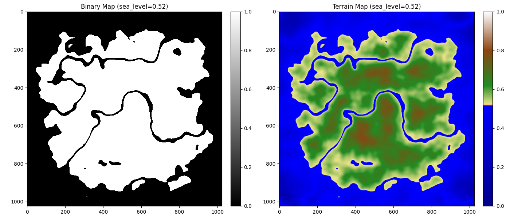
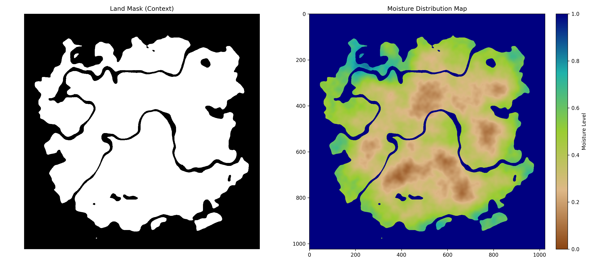
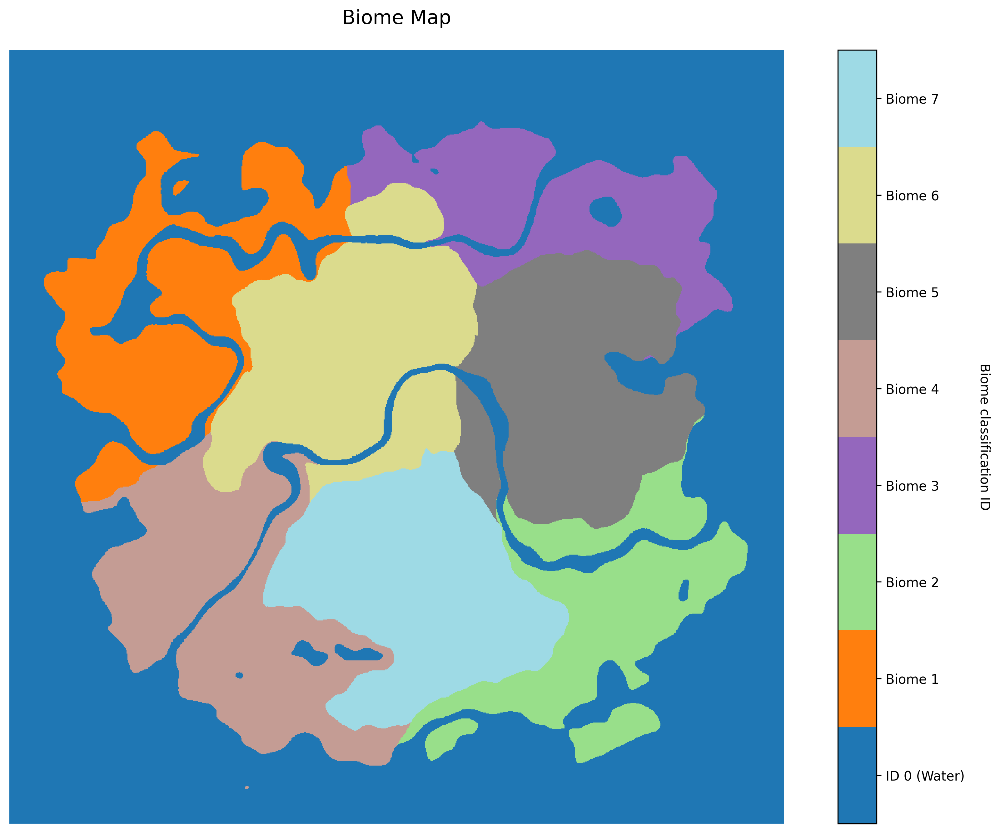
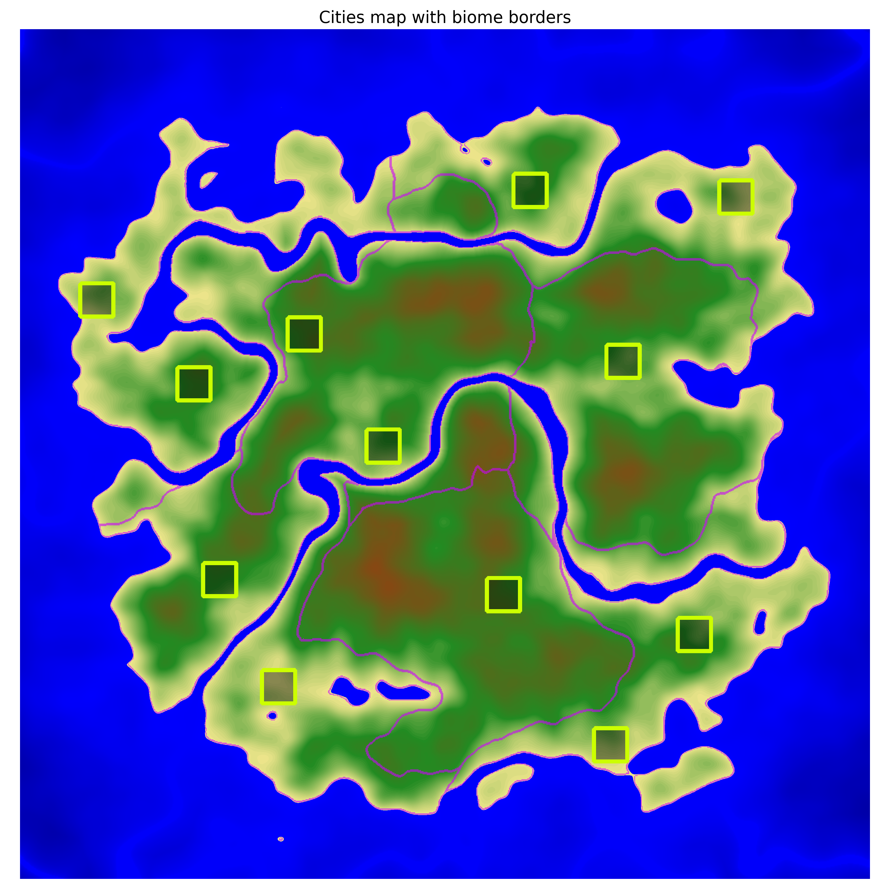
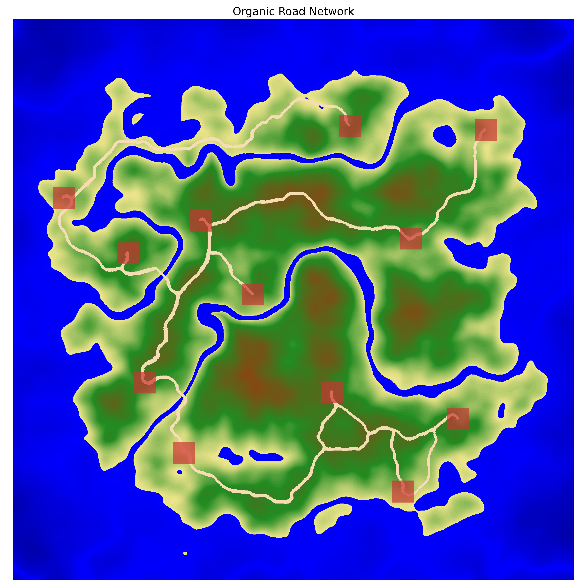
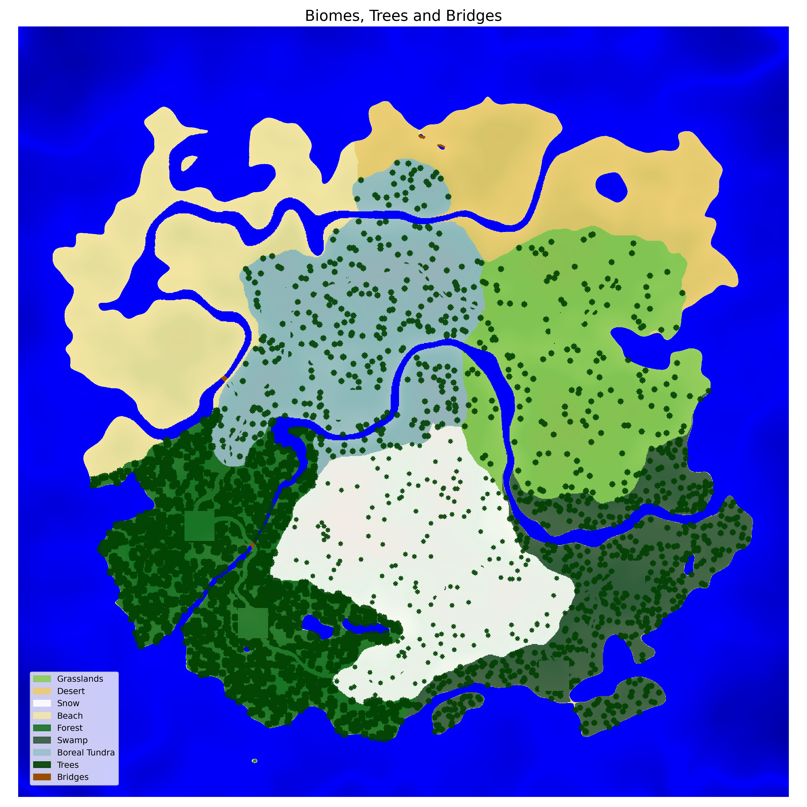
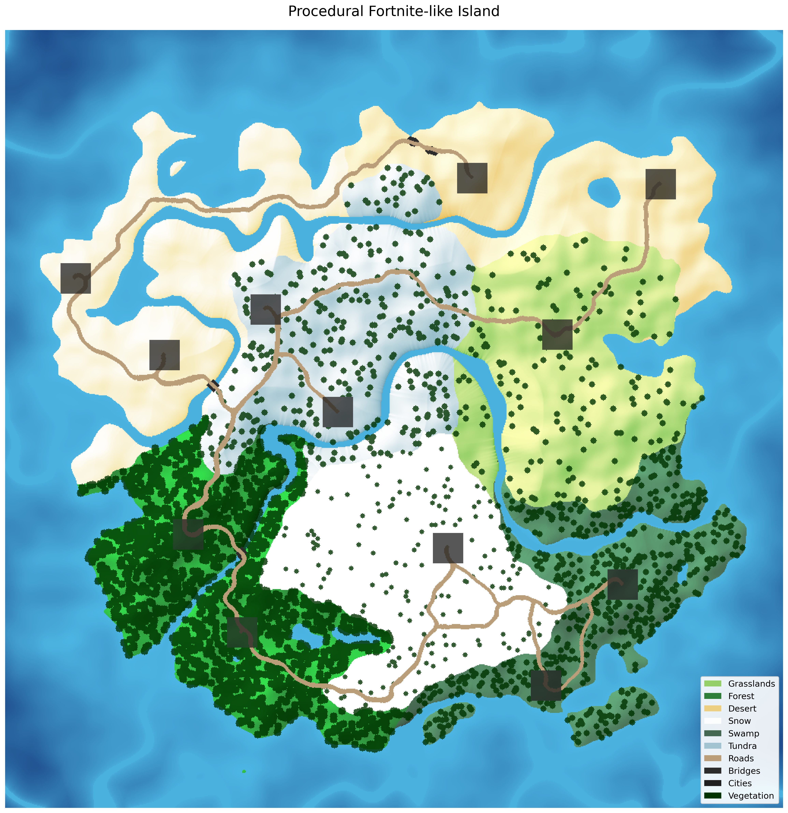

# Fortnite PCG
*Authors: Marcelina Oset, Michał Bojanowski*

## Abstract

Our project aimed to create a PCG system for Fortnite Battle Royale maps. Since building a full 3D world would be extremely time-consuming, we decided to focus on the generation logic itself and created a detailed 2D map generator. This allowed us to concentrate on:

* generating natural-looking island shapes and terrain,
* assigning biomes based on geographical logic, such as elevation, slope, and distance to water,
* creating a balanced layout of cities and roads,
* scattering decorations like trees and rocks, as well as placing city structures.

This system serves as a solid base designed to be easily converted into 3D in the future.

## Introduction

Procedural Content Generation (PCG) enables the automatic creation of large game environments, reducing manual design effort while increasing replayability. In Battle Royale games, terrain layout strongly influences gameplay balance and player strategy, making natural-looking landscapes especially important. This project applies PCG techniques to generate Fortnite-inspired island maps that imitate real-world terrain features such as varied elevation and coastlines.

## Running the code

To run the code following dependencies needs to be installed:
```
pip install numpy matplotlib scipy scikit-learn tqdm
```
Once the environment is ready, execute the following 7 Python scripts in increasing order within the same directory:
```
python3 step1_island_noise.py
python3 step2_moisture_map.py
python3 step3_biome_distribution.py
python3 step4_cities_placement.py
python3 step5_road_network.py
python3 step6_terrain_decorations.py
python3 step7_final_visualization.py
```
Note: Visualizations generated in each step will be saved in the `images/` directory, while the raw numerical data (*`.npy`* files) will be stored in the `data/` directory.


## Methodology & Results

### Step 1 - Terrain generation
This phase focuses on creating the raw topographical data (heightmap) that serves as the canvas for all subsequent game logic.

We generated the base terrain using **Fractal Brownian Motion (fBm)** based on **Perlin Noise**, layering multiple 'octaves' to create complex, naturalistic topography. To shape this into a playable map, we applied **Radial Gradient** attenuation, which progressively lowers the elevation at the edges to form a distinct island coastline.

To define independent river networks, we generated another **Fractal Noise** layer and extract a binary river mask. We then applied the **Euclidean Distance Transform (EDT)** to measure the proximity to these paths, using this data to mathematically carve the terrain into canyons that deepen as they approach the water.



### Step 2 - Moisture map generation

Once the physical terrain layout is established, the system generates a global moisture map to simulate influence of distance of water to natural environment, which is crucial for the logical partitioning of biomes.

Moisture calculation leverages 3 steps.

1. **Applying Gaussian Blur**, while differentiating between oceanic and river moisture.

    **Gaussian Blur** is a standard computer graphics technique acting as a smoothing filter. It blurs the binary water mask using the Gaussian Formula. It takes the sharp boundaries of the water mask and "spreads" the values onto the nearby land. Technically, it calculates a **weighted average** for each pixel: pixels closer to the water source have a strong influence, which smoothly fades out as you move away.

    This creates a natural, curved gradient—unlike a simple distance check, which would create unnatural, straight lines.

    Gaussian Formula (_$x, y$ - distance from the center $\sigma$ - spread intensity_):
$$
\displaystyle G(x, y) = \frac{1}{2\pi\sigma^2} e^{-\frac{x^2 + y^2}{2\sigma^2}}
$$

2. **Applying a small layer of Fractal Noise** (as described in the previous subsection) to add organic variation.

3. In the end, values are **normalized** between 0 and 1.



### Step 3 - Biome Distribution

To partition the island into distinct ecological zones, we employed **K-Means Clustering**, an unsupervised machine learning algorithm that automatically groups terrain pixels.

The algorithm is initialized by placing $k$ random points in the data space, called centroids, and follows an iterative process:
* Every data point is assigned to the nearest centroid.
* New centroids are calculated by finding the geometric center (mean) of all points in each group.

This process repeats until the centroids stop moving, resulting in clusters where members are as similar as possible.

The clustering algorithm analyzed a feature vector composed of 4 key attributes:
* **$X$ and $Y$ coordinates** - to ensure biomes form contiguous, logical regions rather than scattered noise,
* **elevation (height)** - derived directly from the heightmap to distinguish altitude zones (e.g. mountains, lowlands),
* **moisture** - Imported from the map generated in **Step 2** to define water-proximate zones, crucial for distinguishing beaches, archipelagos, and river basins from inland, dry terrain,
* **slope** - calculated based on heightmap to introduce organic irregularity, creating aesthetically jagged transitions like mountain foothills, to prevent unnatural, smooth biome borders.

Users can control the influence of each attribute and the total number of biomes by passing the appropriate arguments to the function.



### Step 4 - Cities placement

In this phase, $N$ cities are distributed across the map using a two-stage algorithm, to create balanced layout:

#### Phase 1: **Round-Robin** Distribution
The code iterates through all identified biomes. For each of them, it performs multiple random placement attempts based on the following constraints:
* flatness & elevation,
* location integrity (avoiding water and biome's borders),
* distance between cities.

#### Phase 2: Random fallback
If the required number of cities cannot be placed within specific biomes, the algorithm switches to a global search. It attempts to place the remaining cities anywhere on the landmass (ignoring biome boundaries while still respecting other constraints).

**Terrain Flattening** - as the final step, the terrain beneath each city is flattened toward its mean elevation using a flattening factor. This ensures a level foundation for future building placement.



### Step 5 - Road Network

This phase constructs a natural‑looking road network connecting all previously placed cities, by combining Delaunay with terrain-sensitive pathfinding algorithms.

#### Phase 1: Global Connectivity via **Delaunay Triangulation**
The initial connectivity graph is established using **Delaunay Triangulation** on city centers. This method is selected to efficiently connect nearest neighbors without too much edge intersection.

Each triangle edge becomes a potential road segment. Edges exceeding a defined length threshold (80% of map dimensions) are pruned to maintain local coherence.

#### Phase 2: Terrain‑Aware Cost Map Construction
Before routing any roads, static navigation cost map is pre-calculated to represent the difficulty of traversing each pixel. The cost function aggregates three components:
* **base cost** - a constant traversal penalty for flat terrain, distance calculated using **octile distance**, which estimates travel cost on a grid by allowing movement in eight directions (horizontal, vertical, and diagonal). It serves as a computationally efficient alternative to Euclidean distance by avoiding expensive square root operations, accurately reflecting how distances are measured on a pixel-based map where diagonal steps cost slightly more than straight ones,
* **gradient (slope) penalty** - calculated using **Gaussian gradient magnitude**; steeper slopes impose exponentially higher costs to prevent roads from traversing cliffs,
* **water penalty** - high weight applied to coordinates below sea level to minimize bridge construction and water crossings.

Together, these factors create a realistic “difficulty landscape” that guides the pathfinding algorithm toward plausible routes.

#### Phase 3: A Pathfinding with Slope Constraints
Candidate connections are processed in ascending order of octile distance to prioritize local connectivity. Optimal routes are resolved using an **A\*** algorithm where the cost function integrates:
* values derived from the static cost map
* reusing of existing roads

#### Phase 4: Post-processing
The raw pathfinding output, consisting of discrete grid coordinates, undergoes **B-spline interpolation**, to smoothen the roads for better visual results.



### Step 6 - Terrain decorations

This phase enriches the previously clustered biome regions with semantic meaning (e.g., Forest, Desert, Swamp) and populates the island with procedural vegetation. While earlier steps focused on geometric and environmental structure, Step 6 introduces ecological identity and visual detail, transforming abstract clusters into recognizable, game‑ready biomes.

#### Phase 1: Biome Statistical Profiling
Before assigning semantic labels, the system computes a set of environmental descriptors for each biome region produced in Step 3. These descriptors summarize the ecological character of each cluster:

* Mean Elevation – distinguishes lowlands, highlands, and mountain peaks

* Mean Moisture – separates arid zones from humid ones

* Distance to Water – identifies coastal vs. inland regions

* Distance to Map Edge – helps detect central vs. peripheral biomes

* Area – useful for tie‑breaking and fallback logic

These statistics form the foundation for deterministic biome classification.

#### Phase 2: Biome Adjacency Graph
To avoid unrealistic biome placements (e.g., Snow directly touching Desert), the system constructs an adjacency graph describing which biome clusters border each other.

This structural information is later used to enforce ecological plausibility—such as preventing Desert from being assigned to a region adjacent to Snow.

#### Phase 3: Deterministic Biome Assignment
If deterministic mode is enabled, each biome cluster is assigned a semantic label using a rule‑based scoring system inspired by real‑world ecology.

The algorithm assigns biomes in a fixed ecological order, ensuring that the most environmentally constrained biomes (Beach, Snow) are placed first. Any remaining clusters are filled with fallback assignments.

Random Mode
If deterministic assignment is disabled, biome names are simply shuffled and assigned arbitrarily—useful for experimentation or stylized maps.

#### Phase 4: Biome Type Map Construction
Once each cluster receives a semantic label, the system converts these names into a numeric biome type map, where each pixel stores an integer representing its biome.

This map becomes the foundation for vegetation placement and later gameplay logic.

#### Phase 5: Procedural Tree Generation
Vegetation is generated using a biome‑dependent density model. Each biome defines:

* Tree density (fraction of pixels that become tree centers)

* Tree radius (size of the circular brush used to paint each tree)



### Step 7 - Final visualization


For this step, all of the generated elements of the island are simply merged into final map.



### Results - time of execution

The generation of the entire map takes approximately 1 to 3 minutes, depending on the number of cities requested. The most computationally intensive phase is the A pathfinding* for the road network.

## Conclusions

#### Summary

Our project successfully demonstrates that complex, Fortnite-inspired game environments can be effectively generated using a 2D procedural pipeline. The combination of noise-based terrain, machine learning for biome partitioning, and cost-aware pathfinding results in a map that feels both natural and strategically viable for a Battle Royale game.

#### Future Work 

The current system serves as a powerful blueprint. Possible future expansions include:

* 3D Export - Porting the heightmap and object coordinates into Unreal Engine 5 using the PCG Framework.
* Structural PCG - Procedurally generating the internal layouts of the cities and buildings placed in Step 4, together with more detailed terrain decorations.

## Literature and references

Most of the concepts implemented in this project were grounded in knowledge gained from previous academic courses, such as **Machine Learning**, and current and prior editions of **AI for Games**. Additionally, we drew significant inspiration and practical insights from online developer communities and technical blogs, with a particular focus on the **r/proceduralgeneration** subreddit.

**Core Algorithms & Theoretical Foundations**:

* Perlin & fractal noise:
    * https://en.wikipedia.org/wiki/Perlin_noise
    * https://paulbourke.net/fractals/noise/
    * Perlin, K. (1985). An Image Synthesizer. SIGGRAPH Computer Graphics.
    * Musgrave, F. K. (2003). Procedural Fractal Terrains. In: Texturing and Modeling: A Procedural Approach.
* Gaussian blur:
    * https://en.wikipedia.org/wiki/Gaussian_blur
* K-means clustering:
    * https://en.wikipedia.org/wiki/K-means_clustering
* Delaunay triangulation:
    * https://en.wikipedia.org/wiki/Delaunay_triangulation
* A*:
    * https://en.wikipedia.org/wiki/A*_search_algorithm
    * Hart, P. E., Nilsson, N. J., & Raphael, B. (1968). A Formal Basis for the Heuristic Determination of Minimum Cost Paths. IEEE Transactions on Systems Science and Cybernetics.
